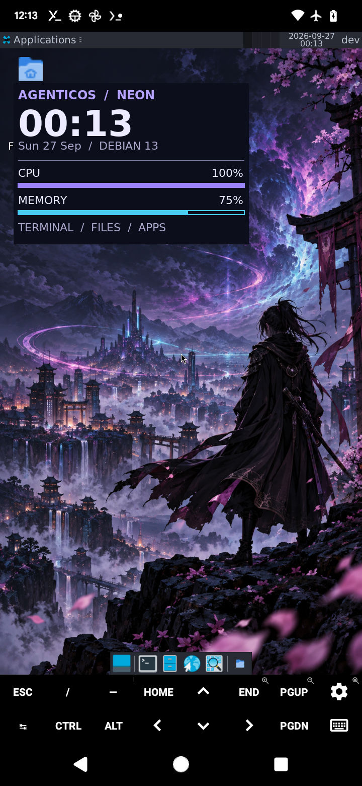
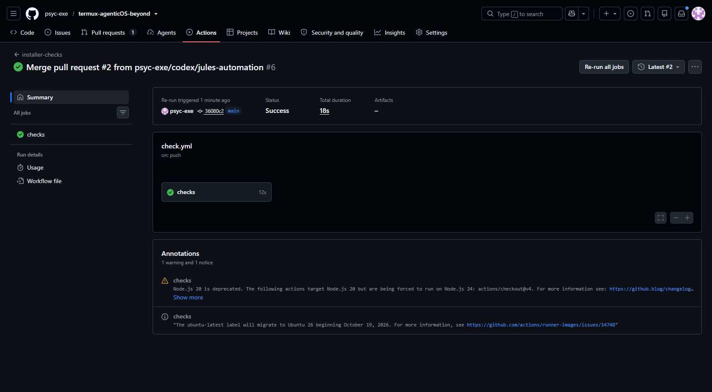

# termux-agenticOS-beyond

A modular Android 12–15+ installer with Debian/Ubuntu, a separate Kali/Parrot tool environment, optional AI CLIs, and XFCE on Termux:X11.

**Status:** software store and native AI integration implemented; phone smoke testing is recorded in `docs/VALIDATION.md`. Full distro installation, GUI, native chroot and agent task/authentication acceptance remain pending. The APK design includes an optional Linux Home launcher; no integrated APK or published download endpoint has been built.

Mi A3, Android 13: a device screenshot of the XFCE desktop during a Termux:X11 test. This captures the display only; the remaining acceptance gates are tracked in [validation](docs/VALIDATION.md).

The [27 Sep installer checks](https://github.com/psyc-exe/termux-agenticOS-beyond/actions/runs/36263091865/attempts/2) passed on `main` (38 shell checks and 20 Python tests). These host checks do not build an APK.

The separate [Android Termux arm64 container run](https://github.com/psyc-exe/termux-agenticOS-beyond/actions/runs/36264509179) failed on 27 Sep in a test fixture that invokes `/usr/bin/env`. [Jules is investigating](https://jules.google.com/session/7127312261449729752). Container checks do not replace device acceptance.

## Run in native Termux

Copy/clone this repository into Termux's private home, then:

~~~bash
git clone https://github.com/psyc-exe/termux-agenticOS-beyond.git
cd termux-agenticOS-beyond
bash install.sh --plan
bash install.sh
~~~

Use a fresh checkout for device testing; record the exact Git commit.

Noninteractive example:

~~~bash
bash install.sh --yes --mode proot --base debian --tools kali \
  --footprint top10 --ai native --tgpt yes --desktop xfce --gpu auto
~~~

**--ai native** installs the pinned third-party Codex VL distribution. **--ai distro** installs Cline and Kilo inside the base guest. Neither authenticates an account or automatically starts an agent.

~~~bash
~/.local/state/termux-linux/bin/linux shell
~/.local/state/termux-linux/bin/linux tools
~/.local/state/termux-linux/bin/linux desktop
~/.local/state/termux-linux/bin/linux doctor
~~~

Use **tools COMMAND** for the security guest, **exec COMMAND** for the base guest, and **admin COMMAND** for package administration. Regular sessions use dev; PRoot's user identity is emulated, not a security boundary.

Install the [Termux:X11 APK](https://github.com/termux/termux-x11/releases/tag/nightly) before launching a GUI. The installer installs its shell companion. Termux:API is optional; this script enables no API-dependent device features.

## Privilege modes

Choose root or non-root PRoot. Shizuku was removed because ADB shell access adds little to Kali/Parrot tool capabilities. Add **--storage** for optional shared-storage access.

Native root accepts a **separately provisioned root-owned filesystem**; see [ROOT.md](docs/ROOT.md). A failed rootfs/capability probe falls back to PRoot or stops with **--fallback abort**. The security guest remains PRoot in every mode.

## Optional terminal help

Setup offers **tgpt: Yes/No**, independently of the coding agents. It reuses the tested native tgpt version, with a pinned native source build as fallback, and sets PowerBrain as the default. No user API key is required by that adapter.

~~~bash
agenticos-chat
agenticos-chat "Explain how to install packages in Debian"
~/.local/state/termux-linux/bin/linux chat "What does this error mean?"
~~~

The first command opens interactive chat. Questions go to the online PowerBrain service; setup sends no questions. Provider availability is not guaranteed, and chat is not a substitute for verified web search. The shortcut treats arguments as question text and does not automatically execute suggested commands. An existing unrelated shortcut is preserved. See [tgpt upstream](https://github.com/aandrew-me/tgpt).

## Software store and beginner profile

`bash software.sh` opens the DietPi-style install-and-configure store. Defaults include
TUIPKG and full tgpt + your tgpt TUI. Optional entries include sgpt + TUI, pinned
Cline/Kilo ports, the PowerBrain MCP worker for OpenCode, and 15 TermuxVoid AI packages.

The installer's final choice is **Beginner-friendly** (Fish, theme, hints, tldr,
fuzzy finding and shortcuts) or **Vanilla** (Bash). Enable the bundle or mix individual
components in the store later. Managed commands share one stable PATH directory.
See [software store, configuration and update locks](docs/SOFTWARE-STORE.md).
For a tablet, use the [ready-to-paste OpenCode test prompt](docs/TABLET-TEST-PROMPT.md),
which opens a new visible Termux session and preserves the existing host Fish setup.

## Design and verification

- [Architecture and operating constraints](docs/ARCHITECTURE.md)
- [Single APK design, including Panix](docs/APK.md)
- [Native root provisioning contract](docs/ROOT.md)
- [Releases, custom dependencies, and recovery](docs/RELEASES.md)
- [Current evidence and device acceptance](docs/VALIDATION.md)

Run **bash scripts/check.sh** on a Bash/Python development host. **--plan** does not invoke Android commands, request root, install packages, or write state.
